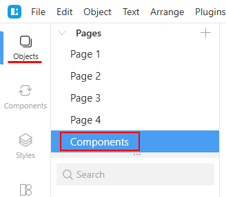
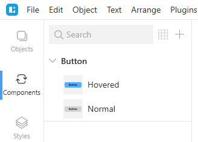
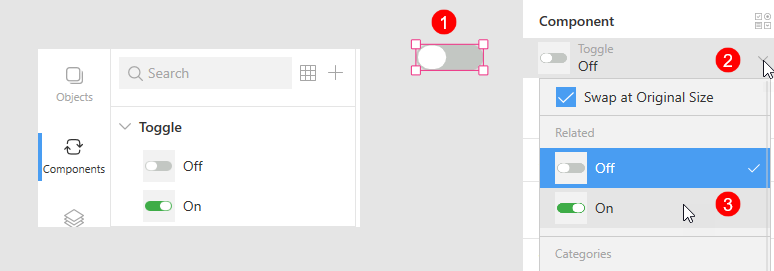
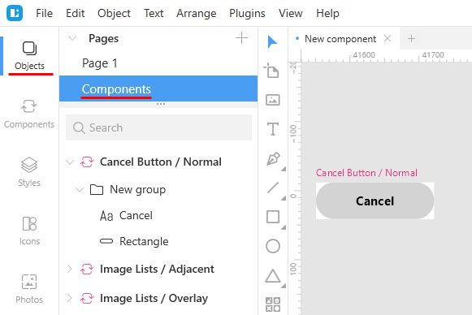
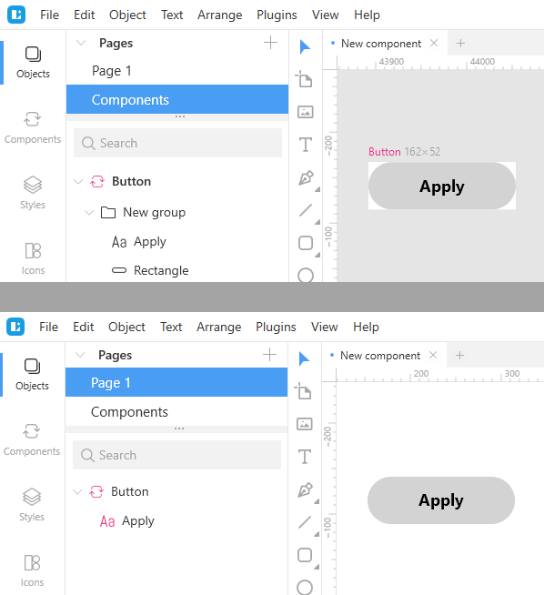
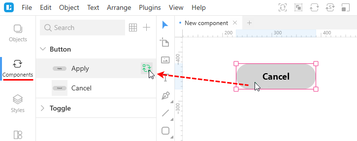
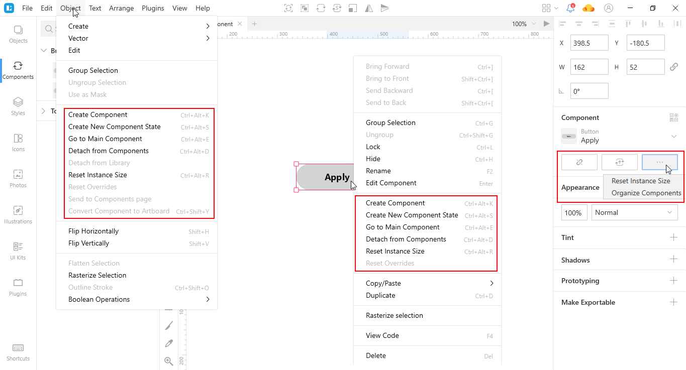
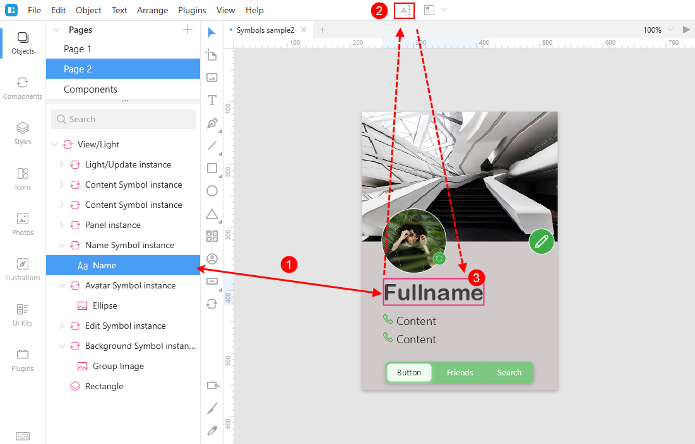
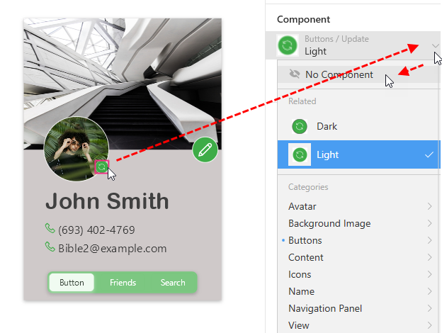
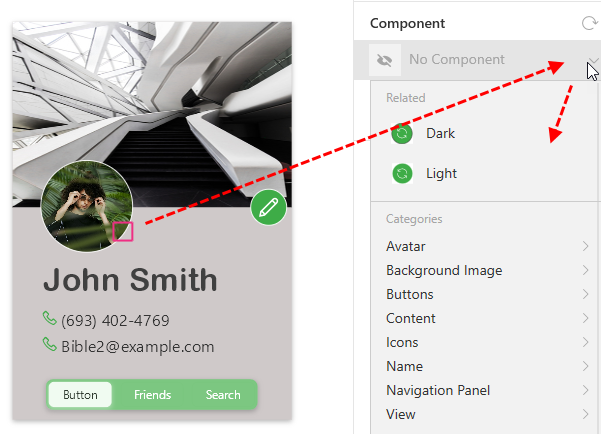

---
# Page settings
layout: default
keywords:
comments: false

# Hero section
title: Components
description: Explore the power of Lunacy by learning how to use components
icon: 'refresh'

# Micro navigation
micro_nav: false

# Page navigation
page_nav:
    next:
        content: Layer and text styles
        url: '/layerstyles'
    prev:
        content: Styling
        url: '/styling'
---

**Components** are reusable objects or groups of objects that make your designs consistent and your life easier.

When working with components you should understand the idea of **main components** and **component instances**. For example, when you are designing a UI, you can create a button component (that will be a main component) and then add identical buttons (component instances) wherever you need them with just a click. If you later decide to change the size, shape or the color of your buttons, you'll need to modify only the main component, and the changes will immediately apply to all the instances.
Moreover, you can also change the text on one or even all instances. That will be an **override**. We will discuss overrides later in this section.

The demo below demonstrates the effect and efficiency of using components in designs.

<video autoplay="" muted="" loop="" playsinline="" width="100%" poster="/public/symbols-demo65ph.png" height="auto"><source src="/public/symbols-demo65.mp4" type="video/mp4"></video>

## [Creating components](#creating-components)

Select an object and perform one of the following actions:

* Click the plus icon in the components panel.
* Click the add component icon on the tool bar at the top of the window.
* Right-click and select **Create component** on the displayed menu.
* Press `Ctrl` + `Alt` + `K`, if you prefer shortcuts.

The **New component** dialog box appears.

In the **New component** dialog box, define the name of the component and select the page where you will store your components and click OK.

## [Components page](#components-page)

You should store all your components on a separate page apart from designs. When you create your first component within a project, Lunacy will offer you to save it to the default page named **Components**. This page will be added to the project automatically.

You can opt to select any other page but make sure that the primary intent of such page will be storing components.

For this, right-click the required page in the **Objects** panel an select **Set as Components page** on the displayed menu.

From now on, when you add new components, the **New component** dialog box will in the first place offer this page for saving components to.

## [Organizing components](#organizing-components)

As your project and the number of components in it grows, you will definitely face the need of organizing components into categories similar to those shown in the figure below.

To divide your components into categories, consider the following format of component names:

`Category name / Subcategory name / Component name`  

For example, to organize your button components, you can give them the following names:

* Button / Normal
* Button / Hovered
* etc.

You don't need to manually create categories and subcategories. Lunacy will show them automatically based on component names. The number of nesting levels for subcategories is not limited. See also [component states](#component-states).

To rename a component:

1. Switch to the **Components** tab on the left.
2. In the **Components** panel, right-click the component and select **Rename** on the displayed menu or use  `F2` as a shortcut.
3. Enter the new name and click `Enter`.

Also you can also rename components through the **Objects** panel when you are on the **Component** page.

## [Component states](#component-states)

Components populating the same category or subcategory are called component states. A typical example, is a toggle element that can be on or off. Or think of a button that can be pressed, hovered, disabled, etc. So, you can create several states of a component and then quickly switch between them through the Inspector as needed.

For this:

1. Select a component instance.
2. In the **Component** section of the Inspector, click the arrowhead to unfold the menu.
3. On the menu, select the required component state.

See also [replacing instances](#replacing-instances).

## Viewing components in the Components panel

There are two display modes for components in the **Components** panel:

* List mode: Shows more of your components library structure along with small previews of the components themselves.
* Grid mode: Shows larger component icons but it is less obvious from the library structure point of view, especially when the number of components in a category is large. It shows all the components from all the subcategories within a category.

To switch between the modes, click the **Show as List/Show as Grid** button at the upper-left corner of the **Components** panel.

To view a larger preview of a component, hover the cursor over the component icon for a moment.

To unfold/fold the content of all component categories, right-click anywhere over the category list and select **Expand All/Collapse All** on the displayed menu.

<video autoplay="" muted="" loop="" playsinline="" width="auto" poster="/public/components-panelph.png" height="auto"><source src="/public/components-panel.mp4" type="video/mp4"></video>

Also, to quickly find the required component, you can type its name in the search field at the top of the **Component** panel.

## Main components

As it was mentioned earlier, you should keep main components on a dedicated page.  In this section, you will learn other details of working with main components.

The first thing you should note is that names of main components appear in bold in the **Objects** panel. Also, all component names, of both main component and instances, come with the component icon () By clicking the name of a main component, you can unfold it to see its content.

The figure below shows a view of a primitive main component, which includes an automatically added component artboard with the name of the component at the top and a layered object.

The intent of component artboards is twofold:

* To provide full compatibility with the native .sketch files.
* To determine the object behavior during resizing.

You can choose to include or not to include the artboard fill into instances of a component. For this:

1. On the **Objects** tab, open the components page.
2. Click the component name in the list of objects.
3. In the Inspector, enable the artboard fill checkbox.
4. Select/clear the **Include in instances** checkbox.  

### Editing main components

There are two ways to edit a main component:

1. In the component editor (the quick one).
2. Directly on the Component page.

**Way 1**

1. Double-click an instance of the component you want to edit.

   OR

   Select an instance of the component you want to edit. Then press `Enter` or click the **Edit main component** button () on the context toolbar.
   
   This enables the component editor. The main component appears over the selected instance. The **Object list** panel displays the list of the component components. The rest of the canvas becomes dimmed.

2. Edit the component in the same way as any other object/group object. You can change its size, color, text or any other properties using the set of tools in the Inspector.
3. To exit the editor, do one of the following:
    * Click  on the context tool bar.
    * Click anywhere over the dimmed area.
    * Press `Esc`.

The changes you make immediately apply to all the component instances across the project (see the demo below), except for the instances with respective overrides.

<video autoplay="" muted="" loop="" playsinline="" width="100%" poster="/public/symbols-editmasterph.png" height="auto"><source src="/public/symbols-editmaster65.mp4" type="video/mp4"></video>

**Way 2**

1. Right-click an instance (on the canvas or in the **Objects** list) of the component you want to edit and select **Go to Main Component** on the context menu. The **Components** page opens with the required component selected.

    OR
  
    Go to the [Components page](#components-page), find and select the required component.
2. Edit the component in the same way as any other object/group object. You can change its size, color, text or any other properties using the set of tools in the Inspector.
3. When you are through with editing:

    * If you used the **Go to Main Component** command, click the **Back to instance** button that will appear in the top-left corner of the canvas.
    * If you chose to manually open the **Components** page, just switch to the required page, to continue working with the project.

### Deleting main components

To delete a main component, you should either do it from the **Components** tab or from the **Components** page.
Note that deletion of a main component turns all its instances into groups.

## Component instances

Instances are copies of components that you use across your project.
In the **Objects** panel, components instances are displayed with the component icon in front of their names. Their names appear in regular type (while main components are displayed in bold) and have the following name format:

`<Component name> instance`  

Click the name of an instance to extend it. The nodes inside an instance are override nodes, that show the elements that you can modify for this component instance only.  For details about overrides, click [here](#overrides).

The figure below shows a view of a component (top) and the way it appears in the **Objects** panels and a view of an instance of this component (bottom).

As you can see, the component node includes the text and the rectangle objects. You can change both these objects:

* The wording and its properties: font size, color, alignment, etc.
* The rectangle properties: size, color, shades, etc.

As for the instance, you can change only the wording (that will be an override) but cannot change typography properties.

### Adding instances to the canvas

To add an instance to a project page:

1. Switch to the **Components** tab.
2. Find the required component.
3. Drag the component to where you want it.

    OR

    Click the **Paste to workspace** icon at the left of the component block, if you are in the list view mode, or just click the component when in the grid view mode. This will add the component instance to the center of the visible canvas.

Also, you can hold down the `Ctrl` or `Shift` key, select and then drop several component instances on the canvas at a time.

<video autoplay="" muted="" loop="" playsinline="" width="auto" poster="/public/components-addinstph.png" height="auto"><source src="/public/components-addinst.mp4" type="video/mp4"></video>

### [Replacing instances](#replacing-instances)

There are two ways to replace an instance on the canvas.

**Way 1.**

1. Select the component instance you want to replace.
2. Find the new component in the components panel.
3. If you are in the list view mode, click the replacement icon on the component block.

    OR

    If you are in the grid view mode, just click the component.

**Way 2**

1. Select the component instance you want to replace.
2. In the **Component** section of the Inspector panel, click the down arrowhead to unfold the menu.
3. Use the menu to find and select the replacement component.

<video autoplay="" muted="" loop="" playsinline="" width="auto" poster="/public/components-replaceinst65-way2ph.png" height="auto"><source src="/public/components-replaceinst65-way2.mp4" type="video/mp4"></video>

The menu features the following sections:

* Commands: Shows the list of component-related commands. Click [here](#component-related-commands) for details.
* Related: Shows the components that share the same category/subcategory with the selected symbol instance.
* Categories: Shows the list of available component categories. You can click through the categories and subcategories to find the required component. For your convenience, the category and subcategories to which the selected component instance belong will have a dot next their names (see the gif below). For details about how to organize components, read [here](#organizing-symbols).
* UI kits: Shows the list of external UI kits from where you can also select a replacement. For details about UI kits, click <a href="https://docs.icons8.com/libraries/#ui-kits" target="_blank">here</a>.

**Tip:** The size of the menu depends on the number of components and component categories in your project. If you don't see the content of the upper or lower menu sections in full, use the scroll.

## [Component-related commands](#component-related-commands)

The figure below shows menu commands that you can use when working with component instances.

To access them,  first select a component instance and then open the menu in the Inspector or click **Object** on the menu bar at the top of the window. Also, you can right-click the required component instance to invoke the context menu.

{:.is-big}

The commands are as follows:

<table>
  <thead>
    <tr>
      <th>Command</th>
      <th>Description</th>
      <th>Keyboard shortcut</th>
    </tr>
  </thead>
  <tbody>
    <tr>
      <td>Create Component</td>
      <td>Creates a new component. Optionally, you can use the <B>Create component</B> button which appears at the top of the window (see the figure above).</td>
      <td><code>Ctrl+Alt+K</code></td>
    </tr>
    <tr>
      <td>Create New Component State</td>
      <td>Creates a new <a href="https://docs.icons8.com/components/#component-states">component state</a>.</td>
      <td><code>Ctrl+Alt+S</code></td>
    </tr>
    <tr>
      <td>Go to Main Component</td>
      <td>Brings you to the main component of the selected instance. To return to the instance from the main component, click the <B>Back to instance</B> button that will appear in the top-left corner of the canvas.</td>
      <td><code>Ctrl+Alt+E</code></td>
    </tr>
    <tr>
      <td>Detach from Components</td>
      <td>When you detach an instance from its main component, it becomes a group. All further changes to the main component will no longer apply to its ex-instance.</td>
      <td><code>Ctrl+Alt+D</code></td>
    </tr>
    <tr>
      <td>Detach from Library</td>
      <td>This command applies only to components from external files, i.e. to components from UI kits. Detached components become document components and appear on the <B>Components</B> tab and the <a href="https://docs.icons8.com/components/#components-page">symbols page</a>. For more information about UI kits, click <a href="https://docs.icons8.com/libraries/#ui-kits" target="_blank">here</a>.</td>
      <td><code>-</code></td>
    </tr>
    <tr>
      <td>Reset Instance Size</td>
      <td>By using this command you can at any moment restore the original size of any component instance.</td>
      <td><code>Ctrl+Alt+R</code></td>
    </tr>
    <tr>
      <td>Reset Overrides</td>
      <td>Use this command to undo all overrides and restore the initial look of an instance. For this, you can also use the reset overrides button that appears in the <B>Component</B> section of the Inspector panel, after an override takes place.</td>
      <td><code>-</code></td>
    </tr>
    <tr>
      <td>Send to Component page</td>
      <td>This command applies only to main components and becomes available only when a component is not on a dedicated components page.</td>
      <td><code>-</code></td>
    </tr>
    <tr>
      <td>Convert Component to Artboard</td>
      <td>This command applies only to main components. It converts the selected main component into an artboard with a group of objects. All the instances of the component convert into groups.</td>
      <td><code>Ctrl+Shift+Y</code></td>
    </tr>
    <tr>
      <td>Organize Components</td>
      <td>A click over this command opens the components panel, where you can organize components as described <a href="https://docs.icons8.com/components/#organizing-components">here</a>.</td>
      <td><code>-</code></td>
    </tr>
  </tbody>
</table>

## Nested Components

Until now we've been considering  only primitive components. But you can also create complex components with other components inside. That will be nested components. And that is nested components that will become real time savers for your projects.

## [Overrides](#overrides)

Overrides are changes that you can make to a specific component instance not affecting the main component and other instances of this component across the project.

Currently, Lunacy provides the following types of overrides:

* Image overrides
* Text overrides
* Nested component overrides
* Layer style overrides
* Text style overrides
* Hotspot overrides
* Tint overrides

## Understanding overrides

This mini tutorial will help you better understand the idea and the power of overrides. Also, you will learn how to use some of the advanced Lunacy features.

Let's assume that we are designing a contact UI. We have prepared two templates: light and dark. In the figure below, they are on the right. The figure is a screenshot of the components page of the project. These two templates are complex components that include several individual components shown to the left of the templates. Once an individual component becomes a part of a complex component, we call it a nested component.

{:.is-big}

>**Note:** To demonstrate Lunacy capabilities to the maximum, we have also added some layer and text styles. For details about them, click <a href="https://docs.icons8.com/layerstyles/" target="_blank">here</a>.

Now, we'll move from the components page to our project page, add one of the templates to the artboard and see the power of components in action.

<video autoplay="" muted="" loop="" playsinline="" width="100%" poster="/public/components-tutorialbeginph.png" height="auto"><source src="/public/components-tutorialbegin.mp4" type="video/mp4"></video>

### Image overrides

Our template contains two image overrides: the avatar image and the background.

We will replace the avatar first. The procedure is follows:

1. Click over the image override on the canvas or select it in the **Objects** panel.
2. In the Inspector, click the **Replace image** button. The **Open** dialog box appears.
3. In the dialog box, select a new image.
4. Click the **Open** button.

Also, you can use the Lunacy photo and image libraries. We will do it for overriding the background image:

1. Switch over to the **Photos** tab.
2. Find the image you like.
3. Drop the image onto the override.

The video below shows both methods of overriding images.

<video autoplay="" muted="" loop="" playsinline="" width="100%" poster="/public/components-imageoverrideph.png" height="auto"><source src="/public/components-imageoverride.mp4" type="video/mp4"></video>

### Text overrides

To demonstrate text overrides we will change the contact's name and contact data.

**Step 1.**

Change the contact's name:

1. Click over the text override on the canvas or select it in the **Objects** panel.
2. Press `Enter` or click the **Edit Object** button on the top bar.
3. Enter the new text.
4. When done, press `Esc` to exit the edit mode.

In Steps 2 and 3 we will use the text generation and text snippets features.

**Step 2.**

Add the contact's phone number:

1. Click over the text override on the canvas or select it in the **Objects** panel.
2. On the top bar, click the down arrowhead next to the **Generate text** button, then select **People > Phone**. Use the `Shift + R` shortcut to refresh generated content, if needed.

**Step 3.**

Add the contact's email:

1. Click over the next text override on the canvas or select it in the **Objects** panel.
2. Press `Enter` or click the **Edit Object** button on the top bar to start editing the override.
3. Enter *;em* and and press `Esc`. Lunacy will replace the *;em* text snippet with a random email address. Use the `Shift + R` shortcut to refresh generated content, if needed.

The gif below demonstrates text overrides described in Steps 2 and 3.

<video autoplay="" muted="" loop="" playsinline="" width="auto" poster="/public/components-textoverrideph.png" height="auto"><source src="/public/components-textoverride.mp4" type="video/mp4"></video>

For details, about text generation and text snippets, click <a href="https://docs.icons8.com/text/#text-generation-and-text-snippets" target="_blank">here</a>.

### Nested components overrides

Now we'll have a look at how nested components overrides work.

**Step 1.**

First of all, let's change the icon in front of the contact's email address for a more suitable one. To be able to quickly do it, we have prepared a set of icons that we will use across the project, converted them into components and placed them to the same category. For details about how to organize components, read [here](#organizing-components).

1. Find and select the icon override in the **Objects** panel or select it on the canvas. The **Component** section appears in the Inspector.
2. In the **Component** section of the Inspector, click the down arrowhead and select the mail icon on the displayed menu.

{:.is-big}

**Step 2.**

At the bottom of our template we have three buttons: one is in the active state, two others are inactive. Let's show how the button will look when hovered over. For this, we have also created an individual component, which will override the current one.
The procedure is as follows:

1. Find and select the button override in the **Objects** panel or select it on the canvas. The **Component** section appears in the Inspector.
2. In the **Component** section of the Inspector, click the down arrowhead. The menu appears.
3. In the categories section of the menu, navigate to the required component (see the gif below).

<!--

{:.is-big}

-->

<video autoplay="" muted="" loop="" playsinline="" width="100%" poster="/public/components-nestedoverrideph.png" height="auto"><source src="/public/components-nestedoverride.mp4" type="video/mp4"></video>

As you might notice, at the end we also made a text override.

#### None override

Also, you can hide a nested component from the template by using the **None override** option.

For this:

1. Find and select the nested component in the **Objects** panel or select it on the canvas. The **Component** section appears in the Inspector.
2. In the **Component** section of the Inspector, click the down arrowhead. The menu appears.
3. In the upper section of the menu, click **No Component**.

Lunacy will override the component you selected with the so-called *none component*. You can always override the none component with any other component.

### Layer and text style overrides

To demonstrate these two types of overrides, let's change the layer style of the padding and the text style of the contact name.

For this:

1. Find and select the override in the **Objects** panel or select it on the canvas.
2. Apply the new style from the Inspector or from the **Styles** tab as shown in the demo below.

<video autoplay="" muted="" loop="" playsinline="" width="100%" poster="/public/components-nestedoverrideph.png" height="auto"><source src="/public/components-stylesoverride.mp4" type="video/mp4"></video>

Repeat the procedure to override text styles of the phone number and email address.

### Hotspot overrides

If your template features a hotspot, you can override its target artboard. Optionally, you can select the none override option to disable the hotspot.

### Tint overrides

For details about tint overrides, read <a href="https://docs.icons8.com/styling/#tint-overrides" target="_blank">here</a>.

## Duplicating components

You can duplicate your existing components and quickly create new ones based on their parents.

To duplicate a component:

* Select the component in the left panel or on the canvas and press `Ctrl + D`.

    OR
* Right-click the component in the left panel or on the canvas, then select **Duplicate** on the displayed menu.
