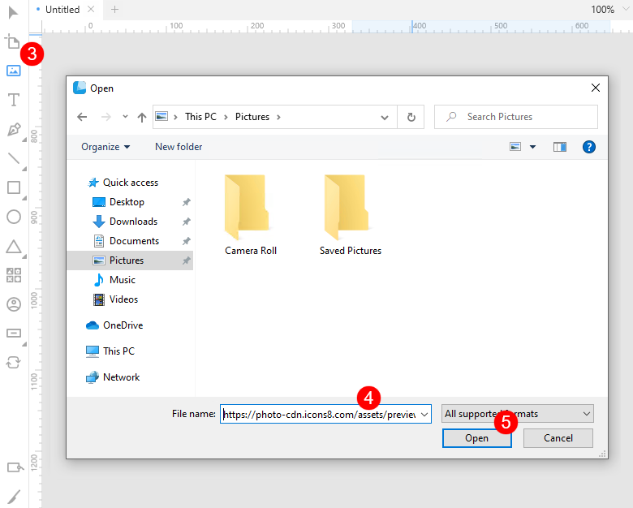
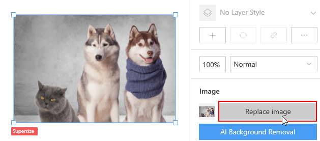

---
# Page settings
layout: default
keywords:
comments: false

# Hero section
title: Images
description: Learn how to work with images in Lunacy
icon: 'full-image'

# Micro navigation
micro_nav: false

# Page navigation
page_nav:
    next:
        content: Export
        url: '/export'
    prev:
        content: Libraries
        url: '/libraries'
---

This chapter details how to work with raster images. Lunacy supports all the popular image formats like PNG, JPG, JPEG, WEBP, BMP, ICO, GIF, SVG. The TIFF format is not supported.

## Adding images

You can:

* Add photos from the Lunacy <a href="https://docs.icons8.com/libraries/#photos-and-masked-photos" target="_blank">library</a>.
* Use the <a href="https://docs.icons8.com/tools/#image-tool" target="_blank">Image tool</a> to add images from your computer.
* Copy image files from your desktop or the Explorer and then paste them onto the canvas.
* Drag image files from your desktop or the Explorer and then drop them onto the canvas.
* Import images from the internet.

There are several ways of adding images from the internet.

**Way 1**

That is the most reliable method.

1. In your web browser, right-click over the image. The context menu appears.
2. On the displayed menu, click **Copy image address** or similar command.
3. Switch to Lunacy and click the Image tool. The **Open** dialog box appears.
4. Paste the image URL into the **File name** field.
5. Click **Open**.

    

6. Click over the area where you want to put the image (this will add the image in its original size) or click and drag to get the required size of the image.

**Way 2**

This method works only when a web site provides direct links to images with an image extension at the end (.jpg, .png, .etc.).

1. In your web browser, right-click over the image. The context menu appears.
2. On the displayed menu, click **Copy image address** or similar command.
3. Switch to Lunacy and right-click over the canvas.
4. Click **Paste here** on the context menu. The **Paste as image** dialog box appears.
5. Click **OK** to paste the image. If you click **Cancel**, Lunacy will paste the image address as text.

**Way 3**

When using this method you should understand that you are importing an image displayed in your web browser rather than the original file, so the quality of such an image will be lower.

1. In your web browser, right-click over the image. The context menu appears.
2. On the displayed menu, click **Copy image** or similar command.
3. Switch to Lunacy and right-click over the canvas.
4. Click **Paste here** on the context menu.

The demo below shows methods 2 and 3.

<video autoplay="" muted="" loop="" playsinline="" width="100%" poster="/public/tool-imgeimportph.png" height="auto"><source src="/public/tool-importimage11.mp4" type="video/mp4"></video>

## Replacing images

There are two ways to replace images.

**Way 1**

1. Select an image on the canvas.
2. In the **Image** section of the Inspector, click the **Replace image** button. The **Open** dialog box appears.

    

3. Browse to the new image file, select it and click **Open**.

    
<strong>Tip:</strong> You can also use this method, when you need to replace your current image with an image from the internet. In such a case, just paste the URL of the new image into the <b>File name</b> field of the <b>Open</b> dialog box and click <b>Open</b>.

    
For more tips and tricks, click <a href="https://docs.icons8.com/tips/" target="_blank">here</a>.

<!--

**Tip:** You can also use this method, when you need to replace your current image with an image from the internet. In such a case, just paste the URL of the new image into the **File name** field of the **Open** dialog box and click **Open**.

-->

**Way 2**

1. Drag an image from the library, desktop or Explorer and hover it somewhere near the center of the current image.
2. Wait a moment until the green mask appears, then release the mouse button.

    
<strong>Tip:</strong> If the green mask does not appear, try to zoom in a bit.

    
For more tips and tricks, click <a href="https://docs.icons8.com/tips/" target="_blank">here</a>.

<!--

**Tip:** If the green mask does not appear, try to zoom in a bit.

-->

<video autoplay="" muted="" loop="" playsinline="" width="auto" poster="/public/images-replaceph.png" height="auto"><source src="/public/images-replace.mp4" type="video/mp4"></video>

## Cropping images

To crop an image:

1. Select the image.
2. Press `Enter` or click  on the context toolbar. The image crop frame gets enabled.
3. Drag the borders of the frame to select the required area.
4. Press `Enter` or click the **Apply editing** button in the Inspector.

<video autoplay="" muted="" loop="" playsinline="" width="auto" poster="/public/images-cropph.png" height="auto"><source src="/public/images-crop.mp4" type="video/mp4"></video>

## Adjusting image colors

You can make color adjustments to your images using the controls in the **Adjust image** section of the Inspector. The section appears only when an image is selected. Just click the `+` button to unfold the panel and move the sliders to adjust hue, saturation, brightness, and contrast.

These adjustments are non-destructive. You can discard all changes and restore the original image by clicking the **Reset values** () button next to the section header (see the demo below).

<video autoplay="" muted="" loop="" playsinline="" width="auto" poster="/public/images-adjustph.png
" height="auto"><source src="/public/images-adjust.mp4" type="video/mp4"></video>

Also, you can adjust color settings of several images at the same time.

## Background removal

**Note:** This feature works fine only with images that feature humans.

To remove background from an image:

1. Select the image.
2. In the inspector, click the **Remove background** button.

<video autoplay="" muted="" loop="" playsinline="" width="auto" poster="/public/tips-bgremovalph.png" height="auto"><source src="/public/tips-bgremove.mp4" type="video/mp4"></video>

## Image upscaler

Lunacy is integrated with the <a href="https://icons8.com/upscaler" target="_blank">Icons8 Image Upscaler</a>. When you add an image to your document, Lunacy will offer you to enhance the image using our state-of-the-art AI.

**Note:** The feature is available only to users with a paid subscription.
